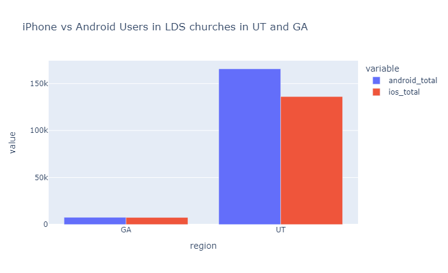
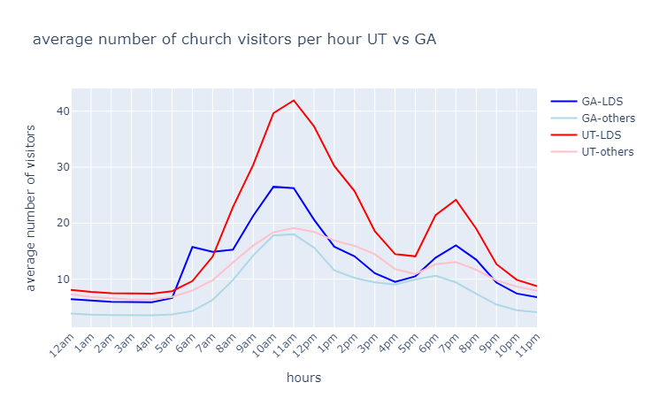
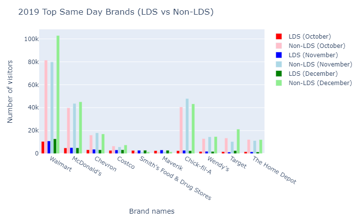

# Church Buildings in Utah vs Georgia

_Marcel Pratikto_

## What differences are there between iPhone and Android users when comparing visits to The Church of Jesus Christ buildings of Latter-day Saints in Utah and Georgia?

```python
device = patterns\
    .select("placekey", "date_range_start", "device_type")\
    .explode("device_type")\
    .unnest("device_type")\
    .pivot(
        index=["placekey","date_range_start"],
        values="value",
        columns="key",
        aggregate_function="first"
        )\
    .join(places,               # combine patterns with places based on placekey
          on=["placekey"],
          how="inner"
        )\
    .filter(                    # only look at data for LDS church buildings
        pl.col("location_name").str.contains("[L|l]atter|lds|LDS")
    )\
    .select(                    # get only columns that are relevant
        pl.col(["placekey","date_range_start","android","ios","region","location_name"])
    )
```

|    | placekey            | date_range_start          |   android |   ios | region   | location_name                                   |
|---:|:--------------------|:--------------------------|----------:|------:|:---------|:------------------------------------------------|
|  0 | zzy-223@5qc-x6f-8d9 | 2019-11-01T00:00:00-06:00 |        44 |    25 | UT       | The Church of Jesus Christ of Latter day Saints |
|  1 | zzw-222@5qd-38t-j35 | 2019-11-01T00:00:00-06:00 |        23 |     4 | UT       | The Church of Jesus Christ of Latter day Saints |
|  2 | zzy-222@5qd-38r-yjv | 2019-12-01T00:00:00-07:00 |        24 |    20 | UT       | The Church of Jesus Christ of Latter day Saints |
|  3 | zzy-222@5qc-x45-4d9 | 2019-10-01T00:00:00-06:00 |         5 |     9 | UT       | The Church of Jesus Christ of Latter day Saints |
|  4 | zzy-222@5qc-x45-4d9 | 2019-10-01T00:00:00-06:00 |         5 |     9 | UT       | The Church of Jesus Christ of Latter day Saints |



The most notable difference is the fact that there are considerably more cellphone users in Utah. When totaled, Georgia's cellphone users does not even come close to the less popular brand in Utah. The second notable difference is that there are more android users than ios users who visit LDS church buildings in both Georgia and Utah, with Utah having much more android users.

## Compare hourly usage patterns between The Church of Jesus Christ of Latter-day Saints and the other churches in each state.

```python
other_hours = patterns\
    .select("placekey", "raw_visitor_counts", "popularity_by_hour")\
    .join(places,               # combine patterns with places based on placekey
          on=["placekey"],
          how="inner"
        )\
    .filter(
        ~pl.col("location_name").str.contains("[L|l]atter|lds|LDS")
    )\
    .select(pl.col(cols_we_want))\
    .with_columns(
        LDS_others = pl.lit("others")
    )
    
hours = pl.concat([lds_hours,other_hours])
```

|    | region   | LDS_others   |   12am_mean |   1am_mean |   2am_mean |   3am_mean |   4am_mean |   5am_mean |   6am_mean |   7am_mean |   8am_mean |   9am_mean |   10am_mean |   11am_mean |   12pm_mean |   1pm_mean |   2pm_mean |   3pm_mean |   4pm_mean |   5pm_mean |   6pm_mean |   7pm_mean |   8pm_mean |   9pm_mean |   10pm_mean |   11pm_mean |
|---:|:---------|:-------------|------------:|-----------:|-----------:|-----------:|-----------:|-----------:|-----------:|-----------:|-----------:|-----------:|------------:|------------:|------------:|-----------:|-----------:|-----------:|-----------:|-----------:|-----------:|-----------:|-----------:|-----------:|------------:|------------:|
|  0 | UT       | LDS          |     8.07035 |    7.71674 |    7.49906 |    7.43757 |    7.40504 |    7.83614 |    9.64521 |   14.0254  |   22.8854  |    30.4277 |     39.6745 |     41.9397 |     37.303  |    30.2037 |    25.7227 |   18.5684  |   14.4584  |    14.0705 |    21.448  |   24.1746  |   19.0126  |   12.6691  |     9.86578 |     8.72577 |
|  1 | GA       | LDS          |     6.41425 |    6.1504  |    5.95251 |    5.88127 |    5.87071 |    6.61478 |   15.7335  |   14.8734  |   15.2718  |    21.3219 |     26.504  |     26.2691 |     20.6174 |    15.7995 |    14.0818 |   11.0475  |    9.51715 |    10.5066 |    13.8311 |   16.0264  |   13.4749  |    9.37467 |     7.41953 |     6.76253 |
|  2 | GA       | others       |     3.84804 |    3.63332 |    3.56184 |    3.53409 |    3.52798 |    3.6716  |    4.29294 |    6.25614 |    9.83706 |    14.2159 |     17.8003 |     18.0102 |     15.6384 |    11.5778 |    10.2007 |    9.40147 |    9.03326 |     9.9359 |    10.5857 |    9.41162 |    7.36218 |    5.45684 |     4.43424 |     4.09123 |
|  3 | UT       | others       |     7.28873 |    6.79437 |    6.5662  |    6.34178 |    6.37958 |    6.81408 |    7.96667 |    9.80188 |   12.9833  |    15.9967 |     18.3678 |     19.1488 |     18.416  |    16.9009 |    15.9477 |   14.4596  |   11.7885  |    10.907  |    12.6582 |   13.0333  |   11.6648  |    9.75376 |     8.65657 |     7.91244 |



On average, there are always more visitors to an LDS church building in comparison to non LDS churches, no matter the state. There are always more visitors in Utah compared to Georgia. The average number of visitors peak at around 10am-noon, with a second, much lower peak at around 7pm. Notice how the average number of visitors are similar for all categories until peak times, when the LDS churches in Utah triumphs.

## Contrast the related_same_day_brand brands between those who visit the Church of Jesus Christ of Latter-day Saints and those who visit other churches.

```python
brand = patterns\
    .unique(subset=["placekey", "date_range_start"])\
    .select("placekey", "date_range_start", "raw_visit_counts", scol)\
    .explode(scol)\
    .unnest(scol)\
    .rename(
        {"key":"brand", "value":"brand_percent"}
    )\
    .with_columns(
        brand_visit_counts = pl.col("brand_percent")/100*pl.col("raw_visit_counts")
    )\
    .join(
        LDS_other_places,
        on="placekey",
        how="inner"
    )\
    .select(
        "placekey", "date_range_start",
        "brand", "brand_visit_counts",
        "LDS_other"
    )\
    .unique(subset=["placekey", "date_range_start", "brand"])\
    .sort("brand_visit_counts", descending=True)\
    .drop_nulls()
```

|    | placekey            | date_range_start          | brand                  |   brand_visit_counts | LDS_other   |
|---:|:--------------------|:--------------------------|:-----------------------|---------------------:|:------------|
|  0 | 222-222@8gb-7gv-t9z | 2019-12-01T00:00:00-05:00 | Jos. A. Bank Clothiers |              9784.71 | other       |
|  1 | 222-222@8gb-7gv-t9z | 2019-11-01T00:00:00-04:00 | Jos. A. Bank Clothiers |              7127.66 | other       |
|  2 | 222-222@8gb-7gv-t9z | 2019-10-01T00:00:00-04:00 | Jos. A. Bank Clothiers |              4159.2  | other       |
|  3 | 222-222@8gb-7gv-t9z | 2019-12-01T00:00:00-05:00 | Walmart                |              2508.9  | other       |
|  4 | 222-222@8gb-7gv-t9z | 2019-12-01T00:00:00-05:00 | Target                 |              2007.12 | other       |



The most obvious conclusion we can make out from the chart is that there are much more non-LDS visitors to all stores, due to the fact that all of the non-LDS church visitors were grouped into one large non-lds group. Most of the brands visited were fast food, gas stations, or grocery stores. There does not seem to be a noticable pattern of which month the brand is more popular in, as the amounts changed each month. The most obvious, however, is that Walmart stays the most popular, regardless of the church categories or month.