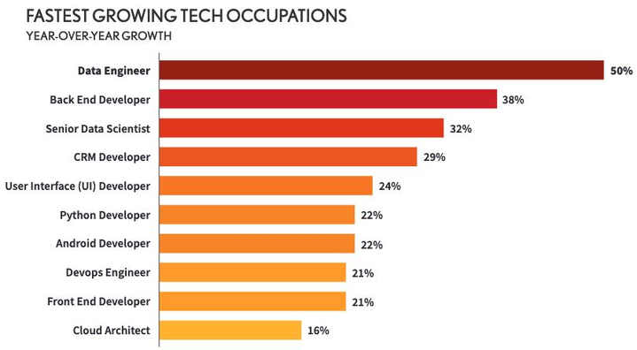
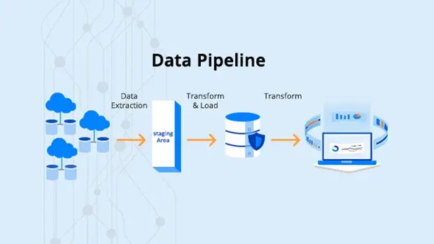

# Data Pipelines
### Silicon Slayers

Source: [Databricks](https://docs.databricks.com/en/getting-started/data-pipeline-get-started.html)

 

## Why Data Engineering? 
Data engineering is the foundation for data science.

## What is a data pipeline? 
Data pipelines are a process for moving data from sources (like a UI/Application) to targets (like a data warehouse). 

Data is extracted from the source, "flows" through the pipeline and neccesary transformations, and is loaded into the target. 

A key feature of data pipelines is automation; data can be loaded in batches or in (near) real time. 

## What is ETL? 
A common abbreviation is ETL, which stands for Extract, Transform, Load. ELT is also becoming more popular with cloud warehouses. 

## What are common ETL Tools? 
- Apache (Airflow, Kafka, Spark)  
- dbt (Data Build Tool)  
- Informatica  

- AWS Glue  
- Google Cloud Dataflow  
- Microsoft Azure Data Factory  

 

## Task: Create a Data Pipeline
Our task is to create a data pipeline that will read in data from a CSV file, transform it, and load it into query ready tables. Then we'll schedule our pipeline with the Databricks Workflow Jobs feature.

We will break out the different steps of our pipeline into different notebooks. 

Why keep them separate? This allows our code to be more modular and, in real organizations, for different teams to work on separate parts of the process. 

Let's get started! 