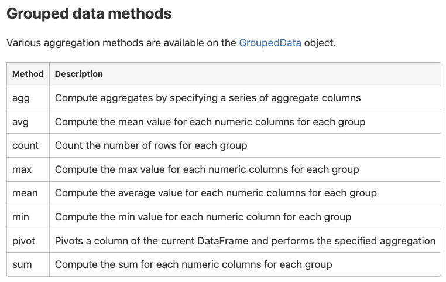

# Spark Sql Aggregation Functions

## Lesson Presentation: Spark SQL Aggregate Functions

### What are Aggregate Functions?
Aggregate functions operate on values across rows to perform mathematical calculations such as sum, average, counting, minimum/maximum values, standard deviation, and estimation, as well as some non-mathematical operations.

#### Common Aggregate Functions

