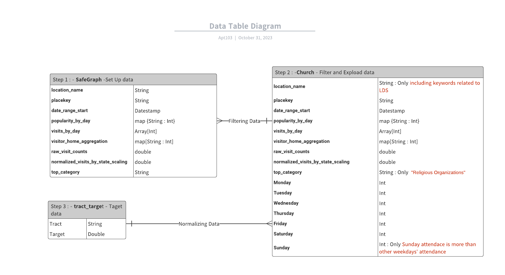
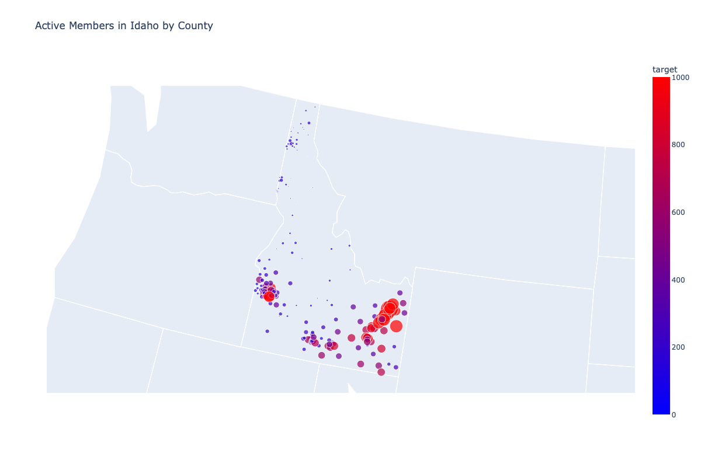
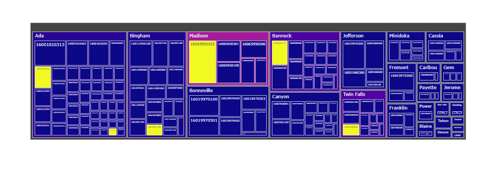

# Apt103 Target Challenge
|Name|Major|
|---|---|
| Tyson Freeze | Computer Science |
| Seth Wilding | Computer Science |
| Justin Morley | Data Science |  
| Tanner Denti | Computer Science |
| Aoi Kuriki | Computer Science |

### [Databricks Link](https://databricks-prod-cloudfront.cloud.databricks.com/public/4027ec902e239c93eaaa8714f173bcfc/6071766409193805/1324621393438927/6927365153622014/latest.html)

# Active Church Members by Tract

The target estimates the number of people actively attending the Church of Jesus Christ of Latter-day Saints by their home census tract. In practice, these counts will be multiplied by the distance to the nearest temple as a finalized regression target.

The target is calculated using the Safegraph dataset which contains information about the number of visitors to each building and which census tract each of them live in from the year 2019. Using the average number of visitors over a year and calculating what percentage of visitors come from each tract, an estimate was created which represents the number active members in each tract. (The reason this is an estimate is because the dataset only tracks a portion of the visitors to each building.)

## Target Construction
### Process
1. Filter to Latter-Day Saint buildings.
2. Extract average weekly Sunday visit counts.
3. Normalize the average visit count using safegraph's `state_sampling_rate`.
4. Take the median of weekly sunday visit counts over month (`weekly_church_attendance_proxy`).
5. Scale `visitor_home_aggregation` until the total number of reported visitors equals our `weekly_church_attendance_proxy`.

```python
# extract weekly sunday visit counts and state_sampling_rate
df = df.withColumns({
    'sunday_visits': transform(df.visits_by_day), get_sundays),
    'state_sampling_rate': \
        df.normalized_visits_by_state_scaling / df.raw_visit_counts
})

# get average weekly Sunday attendance and normalize
df = df.groupby(
        df.month,
        df.visitor_home_aggregation,
        df.placekey
    ).median(
        transform(df.sunday_visits, average) * df.state_sampling_rate
    ).alias(
        'weekly_church_attendance_proxy'
    )

# Scale visitor_home_aggregation so the total visitors 
# listed corresponds with the proxy column.
df.select(
    explode(
        # Scaling up each tract's visitors to equal the
        # weekly_church_attendance_proxy when totaled up.
        transform(
            df.visitor_home_aggregation,
            lambda visitors: visitors * / 
                df.weekly_church_attendance_proxy / transform(
                    df.visitor_home_aggregation,
                    sum
                )
        )
    ).alias('tract', 'target')
)
```

### Data



#### Data Wrangling Snippet
```python
churches = safegraph.select(
        "*",
        *[F.col("popularity_by_day")[key].alias(key) for key in safegraph.select("popularity_by_day").first()[0].keys()]
    ).filter(
        (F.col("Sunday") > F.col("Monday")) &
        (F.col("Sunday") > F.col("Tuesday")) &
        (F.col("Sunday") > F.col("Wednesday")) &
        (F.col("Sunday") > F.col("Thursday")) &
        (F.col("Sunday") > F.col("Friday")) &
        (F.col("Sunday") > F.col("Saturday"))
    )
```
#### First 5 rows
|tract      |target|
|-----------|------|
|CA:48020020|9.0   |
|CA:35390023|20.0  |
|56041975400|0.0   |
|56041975300|52.0  |
|56041975200|29.0  |

## Visualizations




<hr>

## Additional Snippets

Extracting Weekly Sunday Visits
```python
churches.withColumns({
        'visits_by_sunday': F.array_remove(
        F.transform('visits_by_day', lambda visits, i: F.when(
                i % 7 ==\
                    (F.dayofmonth(F.col('date_range_start')) - F.dayofweek(F.col('date_range_start')) + 7) % 7 # index of first Sunday
                , visits
            ).otherwise(-99999)
        ),
        -99999
        )
    })
```

Averaging Weekly Sunday Visits
```python
def avg_accumulator(acc, x):
    count = acc.count + 1
    sum = acc.sum + x
    return F.struct(count.alias("count"), sum.alias("sum"))

churches = churches.select(
        F.aggregate( # average
            F.transform('visits_by_sunday', lambda visits: F.floor(visits * F.col('state_sampling_rate'))),
            F.struct(F.lit(0).alias("count"), F.lit(0.0).alias("sum")),
            avg_accumulator,
            lambda acc: acc.sum / acc.count
        ).alias('avg_weekly_sunday_visits_scaled') # proxy for active church-goers
    )
```
