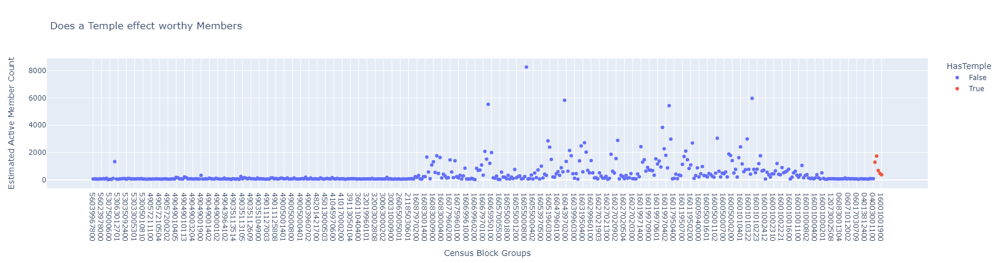

# Report
## What is The Target Feature

The target feature is the average distance for active members per census tract. To know this the active members per census tract need to be known. To get the value the amount of visitors to churches on Sundays for LDS church buildings was used to get the number of visitors for each census that the Safegraph data had acquired. This estimate was then scaled by another value to get a more accurate representation of the state.

## Pseudocode

1. drop duplicate placekeys to remove multiple times for a single location

2. divides raw visits by visitor count to obtain visitor percentage.

3. multiplies visitor percentage into the normalized state_visit_counts to create a scaled visitor count

4. aggregates the vistorhomecbgs into a total quantity to be later used

5. Explodes visitor home cbgs and keeps the total for each cbgs and the scaled visitor count.
  
6. creates a percentage ratio of each cbgs value versus the total amount from the home aggrgation to create a percentage of visitors to a location from a cbgs. ex 4 from a cbgs / 65 total to a building.

7. Distributes the percentage ratio into the scaled visitor count to get the total members as a percentage of people that went to a building.

8. reduces down to cbgs and members and uses ceil to remove a few decimals.

9. groups by cbgs and aggreagetes members on cbgs with sum

10. joins county and track information on cbgs

11. aggregates members onto tract

## Diagram of the Tables and Columns
 
 col name | desc |
 -- | -- |
 cbgs | census block group
 value | vistors to a location from a cbgs
 total | total amount of cbgs visiters per placekey
 visitor_scaling | scaled visitor count
 percent_total | value/total as a percentage of visitors from a cbgs
 members | visitor_scaling * percent_total
 total_members | members aggregated to cbgs and then aggregated to tract
 county | county number
 cnamelong | county name
 tractcode | tract code
 
## Code Snippet that demonstrates the Wrangling done and the Chart created

Gathering Churches
```
df = df.withColumn('websites', regexp_replace(col('websites'), r'[\[\]]', ''))
df = df.filter((col('websites').like('%lds.org%')) | (col('websites').like('%mormon.org%')) | (col('websites').like('%churchofjesuschrist.org%')) | (col('websites').like('%comeuntochrist.org%')) | (col('websites') == ''))

days_of_week = ["Monday", "Tuesday", "Wednesday", "Thursday", "Friday", "Saturday", "Sunday"]
for day in days_of_week:
    df = df.withColumn(day, col("popularity_by_day").getItem(day))
df = df.drop("popularity_by_day")
days_of_week = ["Monday", "Tuesday", "Wednesday", "Thursday", "Friday", "Saturday"]
for day in days_of_week:
    df = df.filter((col('Sunday') * 2) > col(day))
df = df.filter(df.Sunday > 5)
```
Estimating Active Members
```
a = a.withColumn('visitor_scaling', (col("normalized_visits_by_state_scaling") * ((col("raw_visitor_counts") / col("raw_visit_counts")))))
a = a.withColumn('totalcbgs', map_values('visitor_home_cbgs')).select("*", aggregate("totalcbgs", lit(0), lambda acc, x: acc + x).alias("total")).drop("totalcbgs")
a = a.select(explode(a.visitor_home_cbgs).alias("cbgs", "value"), "total", 'visitor_scaling') \
        .withColumn("percent_total", (col("value") / (col("total")))) \
        .withColumn("members", col("percent_total")*col("visitor_scaling"))
a = a.select("cbgs", ceil("members").alias("total"))

```
Spatial Map
```
fig = go.Figure(data=go.Scattergeo(
        lon = MemberGraph['longitude'],
        lat = MemberGraph['latitude'],
        text = MemberGraph["tract"],
        mode = 'markers',
        marker_color = MemberGraph['sum_state_tract'],
        color=df2.select('Sunday_Totals_Scaled_by_Month').rdd.flatMap(lambda x: x).collect(),
        locationmode="USA-states"
        ))

fig.update_layout(
        title = 'Estimated Active Member Counts for Each Tract)',
        geo_scope='usa',
    )
```
With and Without Temples
```
fig = px.scatter(data_frame=MemberGraph, x= "tractcode", y="sum_state_tract",color="HasTemple",title="Does a Temple effect worthy Members")
fig.update_layout(
    xaxis_title="Census Block Groups",
    yaxis_title="Estimated Active Member Count"
)
```

## Visualizations
### spatial mapping


### comparing the feature for tracts with and without temples


## the first five rows of your feature table used in the visualizations sorted descending by Track ID
|    |   county |   tractcode | HasTemple   | cnamelong         |   total_members |
|---:|---------:|------------:|:------------|:------------------|----------------:|
|  0 |      039 | 56039967800 | False       | Teton County      |              68 |
|  1 |      039 | 56039967702 | False       | Teton County      |              70 |
|  2 |      039 | 56039967600 | False       | Teton County      |              66 |
|  3 |      037 | 56037970902 | False       | Sweetwater County |              55 |
|  4 |      023 | 56023978100 | False       | Lincoln County    |              78 |
