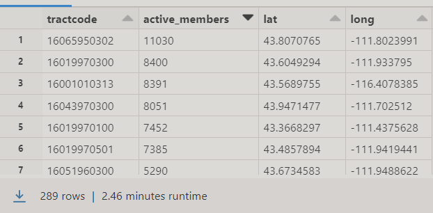

### Model Table


- __TARGET:__ The number of members actively attending church `X` distance to the nearest temple.
- __Unit of Analysis:__ We would store our data with every row representing a tract. 


### Items of concern


- How will you verify that you are only using standard meeting houses?

At first we did regex functions in the places table on the location_name column to filter out only buildings that have the name of the church or at least close to it.
A snippet to what we just added to the regex that was already given for us to use.

``` {python}
(F.col("location_name").rlike("^((?!Beehive Clothing).)*$"))

```

We then joined the places and patterns table by place_key.
We exploded popularity_by_day then grabbed the Sunday visitors for each placekey / total visitors for the whole week then multiplied by the mormalized_visits_states_scaling which will give us the normalized Sunday attendance.

``` {python}
weekday_columns = ["Monday", "Tuesday", "Wednesday", "Thursday", "Friday", "Saturday", "Sunday"]
monthly_att_var = 1.5 * 5
new_patterns_wide = new_patterns_wide.withColumn("total_weekdays", sum(F.col(col) for col in weekday_columns))
new_patterns_wide = new_patterns_wide.withColumn("norm_sunday_visits", F.round(((F.col("Sunday")/ F.col("total_weekdays")) * F.col("norm_visits"))/ monthly_att_var))

```


Because of the laplacian noise in the visitor_home_aggregation_column we decided to find the proportion for each vector attached to each place key. Then take that proportion and multiply it by normalized_sunday_visits to find the actual active_members.


``` {python}

prop_window = Window.partitionBy("placekey","month")
new_patterns_wide  = new_patterns_wide.withColumn("prop_vector", F.round(F.col("from_tractcode_count")/(F.sum("from_tractcode_count").over(prop_window)),2))                                                            

new_patterns_wide  = new_patterns_wide.withColumn("active_members", F.round(F.col("norm_sunday_visits") * (F.col("prop_vector"))))

```

And we used window functions to be able to calculate that. 

We joined that our grouped table with the tract table by place_key.
Then we grouped total active_members by tract_code.





