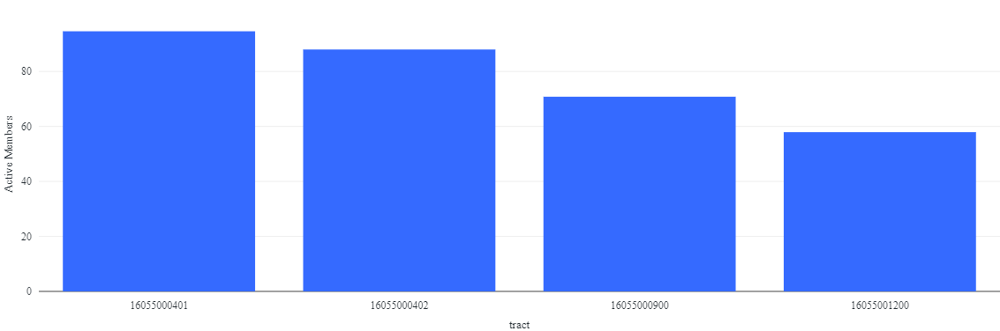

# Marquet Team Report

## Describe the target

The goal is to estimate how many active Latter Day Saint members there are in each census tract in the United States each month.

## Pseudocode

1. Filter for only Church buildings with Copeland's webscraped data, and some regex from.
2. Filter out Church buildings that have no Sunday visits
3. Multiply normalized_visits_by_state_scaling by % of visits on a Sunday
4. Multiply product from Step 3. by % of visits over 20 minutes
5. Divide Step 4. now by 4.345 (weeks per month) = Active members
6. Multiply Active members by the % of visitors from each tract in visitor_home_cbgs.
7. Average Active members in the tracts for each POI - This fixes that we work with 11 months of data. Now I have the average data for the 11 months.
8. Sum the Active members in the tracts

## Comparing Pseudocode from SiliconSlayers


## Copeland's Code snippet of the wrangling the data and charts he created
```(python)
    import pyspark.sql.functions as sf
    final = (rPatterns
    .select('sundayAttendanceRatio', sf.explode('visitor_home_aggregation'))
    .select(
        sf.col('key').alias('tractcode'),
        (sf.col('sundayAttendanceRatio') * sf.col('value'))
            .alias( 'estimatedAttendance')
    )
    .groupBy('tractcode').agg(sf.sum('estimatedAttendance'))
    .sort('tractcode')
    )
```

## 2 visualizations


## Code Snippet from munging_final.ipynb

```(python)

df_v2 = df_v1.withColumn("Sunday_visits_actual", col("normalized_visits_by_state_scaling") * col("Sunday_visits") / col("raw_visit_counts"))\
             .withColumn("churchVisitTime_ratio", col("churchVisitTime") / col("raw_visit_counts"))\
             .withColumn("Sunday_visits_actual_v2", col("Sunday_visits_actual") * col("churchVisitTime_ratio"))\
             .withColumn("Sunday_members", col("Sunday_visits_actual_v2") / 4.345)\
             .withColumn("values", map_values(col("visitor_home_aggregation")))\
             .withColumn("tractTotals", expr("aggregate(values, 0, (acc, x) -> acc + x)"))\
             .select("*", explode(col("visitor_home_aggregation")).alias("tract_num", "tract_visitors"))\
             .withColumn("tract_members", col("Sunday_members") * col("tract_visitors")/col("tractTotals"))\
             .groupBy('placekey', 'tract_num')\
             .agg(
                sum("tract_members").alias("tract_members_v2"), 
                count("*").alias("church_patterns_count")
             )\
             .withColumn("tract_members_v3", col("tract_members_v2") / col("church_patterns_count"))\
             .groupBy('tract_num')\
             .agg(
                sum("tract_members_v3").alias("final_tract_members"),
                count("tract_num").alias("tract_count"),
             )\
             .withColumnRenamed("tract_num", "tract")\
             .withColumnRenamed("final_tract_members", "active_members")\
             .filter(col("tract_num").like("16%"))
```

All Tract Active Members


Percent of All Tract Active Members


Rexburg Active Members


Percent of Rexburg Active Members


Courd Tract Active Members


Percent of Courd Tract Active Members


## Table Summary
| mean   | standard Deviation | min    | max      | 25% quartile | 50% quartile | 75% quartile |
| ------ | ------------------ | ------ | -------- | ------------ | ------------ | ------------ | 
| 316.1  | 370.11             | 3.64   | 2897.2   | 75.18        | 185.52       | 392.00       |

### Target Table
| tract       | active_members    |
| ----------- | ----------------- |
| 16029960100 | 719.2574355372498 |
| 16031950100 | 399.40146051469225 | 
| 16027021700 | 187.12508168431478 |
| 16055000500 | 66.69136601168864 |
| 16031950300 | 522.8948417134097 |


Showing Additional Data
### Table rows of the Rexburg Tracts

| tract       | population | active_members | %_active_members |
| ----------- | -------------- | ---------- | ---------------- |
| 16065950100 | 6035 | 1345.8 | 22.3 |
| 16065950200 | 4602 | 743.4  | 16.2 |
| 16065950301 | 3208 | 1320.8 | 41.2 |
| 16065950302 | 13852 | 2897.2 | 20.9 |
| 16065950400 | 6531 | 923.3 | 14.1 |
| 16065950500 | 4872 | 1182.5 | 24.3 |

### Table of the Courd Tracts

| tract | population | active_members | %_active_members |
| ----- | -------------- | ---------- | ---------------- |
| 16055000401 | 5808 | 94.6 | 1.6 |
| 16055000402 | 8894 | 88.0 | 1.0 |
| 16055000900 | 5978 | 70.8 | 1.2 |
| 16055001200 | 6535 | 57.9 | 0.9 |
